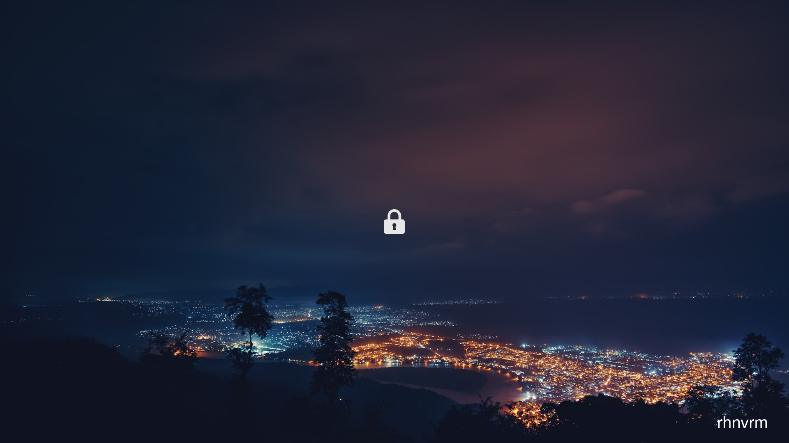

# simplelock
Fast and simple wrapper over i3lock with multiple modes.

Updates happen in the background while your machine is locked, 
and appear behind the next time you lock your screen.

## Sample

## Usage

`simplelock <mode>`

### Available modes

#### `unsplash`: fetches a random wallpaper from unsplash

Usage:

`simplelock unsplash <resoultion> <query>`

Example:

`simplelock unsplash 1920x1080 nature,buildings`

#### `xkcd_latest`: fetches the latest xkcd comic and tiles it 

Example:

`simplelock xkcd_latest`

#### `xkcd_random`: fetches random xkcd comic and tiles it

Example:

`simplelock xkcd_random`

#### `custom_fetch`: fetch image from any url

Example: 

`simplelock custom_fetch https://my.domain/image.png`

#### `custom_file`: use any image available locally

Example: 

`simplelock custom_file ~/Pictures/wallpapers/current.png`
